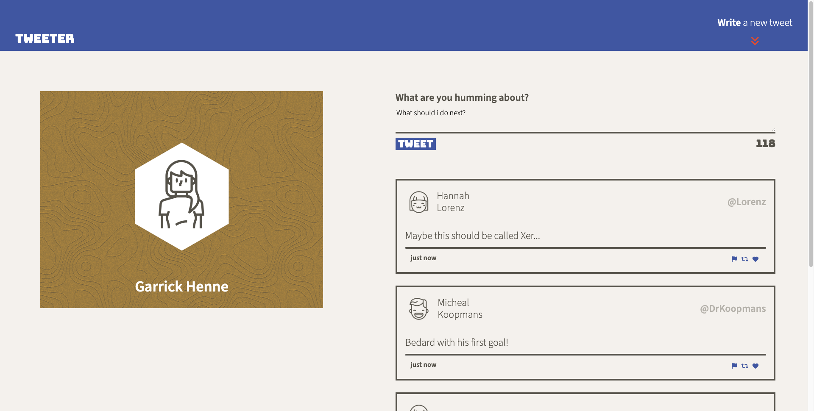
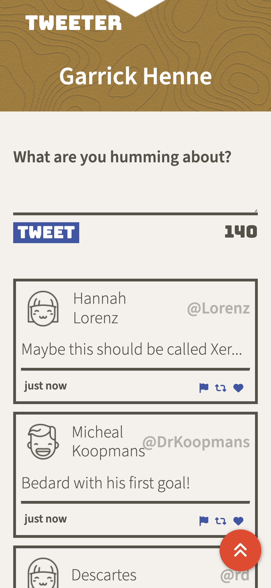

# Tweeter Project

Tweeter is a simple, single-page Twitter (AKA X) clone. Created in `JS` and serves as a basic UI template with dynamic loading of tweets, and rerendering on events.

## Screenshots

## Tools Used

- Node
- Express
- AJAX
- jQuery
- Sass

## Getting Started

1. [Create](https://docs.github.com/en/repositories/creating-and-managing-repositories/creating-a-repository-from-a-template) a new repository using this repository as a template.
2. Clone your repository onto your local device.
3. Install dependencies using the `npm install` command.
4. Start the web server using the `npm run local` command. The app will be served at <http://localhost:8080/>.

   - Optionally, you can run `npm run sass-watch` to create a watcher for `SASS` changes.

5. Go to <http://localhost:8080/> in your browser.

## Dependencies

- Express
- Node 5.10.x or above
